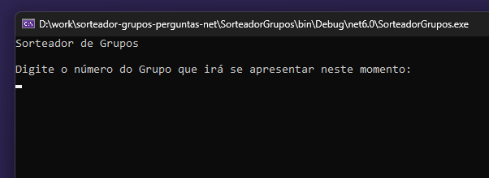

<h1 align="center"> 🖳 Sorteador 🖳</h1>

    

 <a href="#status">Status</a> • 
 <a href="#objective">Objetivo</a> •
 <a href="#installation">Desenvolvimento</a> • 
 <a href="#technology">Tecnologias</a> • 
 <a href="#author">Autor</a> • 
 <a href="#licence">Licença</a>

<h2 align="center" id=status> 
	⌛ Concluído ⌛
</h2>

<h2 id=objective>📜 Sobre</h2>
Um projeto para apoiar o sorteio de perguntas acadêmicas!

<h2 id=installation>✔️ Desenvolvimento</h2>

Você precisa de ter o Visual Studio ou VsCode instalado para testar o projeto. 
Consequentemente precisará do SDK .Net 6.

<h2 id=technology>🧰 Tecnologias</h2>

As seguintes tecnologias foram utilizadas neste projeto:

- IDE: <a href="https://visualstudio.microsoft.com/pt-br/vs/">Visual Studio 2022</a>
- SDK: <a href="https://dotnet.microsoft.com/pt-br/download/dotnet/6.0">.Net 6</a>
  
<h2 id=author>😎 Autor</h2>

Developed by <a href="https://www.linkedin.com/in/danhpaiva/" target="_blank">Daniel Paiva</a>

<h2 id=licence>🆓 Licença</h2>

Este projeto está sob a licença
<a href="https://github.com/danhpaiva/CatalogoAPI-Net-7/blob/main/LICENSE" target="_blank">MIT</a>
